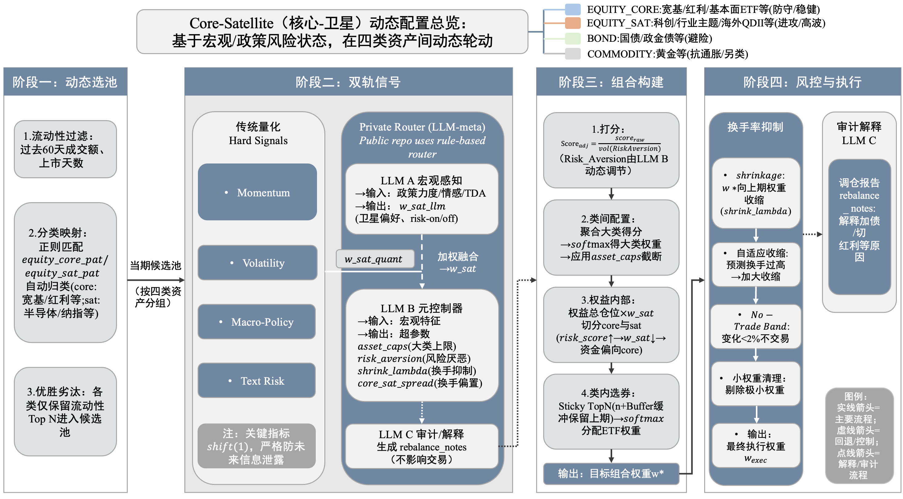

# PKLemon Public (Reproducible Pipeline)

This repo is a **public, reproducible** version of my PKLemon-style multi-asset ETF allocation/rotation system.
It keeps the **same architecture & interfaces** as the private full version, while using **surrogate signals + CSV demo data** for verification.

## What you can verify here
- Month-end rebalance calendar
- Router-like parameter dispatch (caps / risk_aversion / core-sat spread / topN) via public rules
- Turnover controls: sticky topN + no-trade band + adaptive shrink
- End-to-end pipeline: weights → backtest → trades/turnover → benchmark → audit logs

## Architecture
Public repo implements the reproducible pipeline; the private full version replaces the router with LLM-meta and uses licensed data.



## Private full version (verified, not published)
- The full PKLemon version includes licensed data + proprietary signals + LLM-meta routing.
- It runs on CUFEL-Q Arena (simulated live; not real live trading) and is **continuously updated**.

Arena verification links (keep as-is):
- Leaderboard: https://cufel.cufe.edu.cn/cufel-q/leaderboard
- PKLemon Agent: https://cufel.cufe.edu.cn/cufel-q/agents/73
- SanCeagent: https://cufel.cufe.edu.cn/cufel-q/agents/28

---

## Quickstart (public demo)

### One-liner
```bash
python -m venv .venv && source .venv/bin/activate && pip install -r requirements.txt && python scripts/run_demo.py --config configs/demo.yaml
```

### 1) Setup
```bash
python -m venv .venv
source .venv/bin/activate
pip install -r requirements.txt
```
### 2) Run demo
```bash
python scripts/run_demo.py --config configs/demo.yaml
```
### 3) Outputs
Generated under `outputs/`:
- `weights.csv` : rebalance-day portfolio weights
- `nav_series.csv` : NAV series
- `positions_df.csv` : positions by date
- `trade_records.csv` : trades
- `turnover_records.csv` : turnover records
- `benchmark_nav.csv` : benchmark NAV (EqualWeight)
- `benchmark_equal_weight.csv` : benchmark weights file
- `audit/audit.jsonl` : per-rebalance audit trail (features/params/selected/weights)

## Notes
Public demo metrics validate the **pipeline and execution logic** and are not representative of the private full version.
